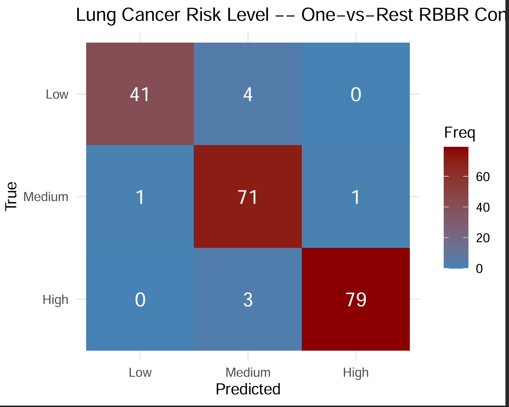

# Boolean Rule-Aware Risk Stratification for Three-Level Lung Cancer Risk

**A one-vs-rest RBBR example on real clinical data**
Mohammad Eskandarian

---

## Abstract

Multi-class disease risk stratification is common in clinical practice — for
example, classifying patients into low, moderate, or high lung cancer risk
rather than a simple positive/negative call — but most interpretable-rule
methods are built around binary outcomes. This example demonstrates a
one-vs-rest application of **RBBR (Regression-Based Boolean Rule)**, the
published R package accompanying Eskandarian & Malekpour (2026), to a
1000-patient, 23-feature, three-class lung cancer risk dataset (Low /
Medium / High). Three independent binary RBBR models — one per class —
are trained and combined by probability argmax into a single three-class
prediction. On a held-out 200-patient test set, the resulting classifier
reaches **95.5% overall accuracy** (Cohen's κ = 0.930), with each class
individually distinguished by its own compact, human-readable Boolean
rule set. The exercise shows that RBBR's binary-classification building
block extends cleanly to multi-class clinical risk stratification via
straightforward, fully-documented use of the public package API, while
preserving what matters most for clinical adoption: every class boundary
remains traceable to a short, explicit combination of symptoms and risk
factors rather than to opaque model weights.

---

## Method

- **Dataset**: [Kaggle "Cancer Patient Data Sets"](https://www.kaggle.com/) —
  1000 patients, 23 clinical/lifestyle features (age, gender, air
  pollution, alcohol use, dust allergy, occupational hazards, genetic
  risk, chronic lung disease, balanced diet, obesity, smoking, passive
  smoking, chest pain, coughing of blood, fatigue, weight loss, shortness
  of breath, wheezing, swallowing difficulty, clubbing of finger nails,
  frequent cold, dry cough, snoring), target `Level` ∈ {Low, Medium,
  High}. No missing values. Identifier columns (`index`, `Patient Id`)
  dropped before modeling.
- **Split**: single stratified-by-nothing random 80/20 train/test split
  (seed 42), shared across all three class models so the final confusion
  matrix compares apples to apples.
- **Per class**: binary target = 1 if patient belongs to that class, 0
  otherwise → `RBBR::rbbr_scaling()` → `RBBR::rbbr_train()`
  (`max_feature = 3`, `mode = "1L"`, `slope = 10`, `balancing = TRUE`) →
  `RBBR::rbbr_predictor()` (`num_top_rules = 5`) on the held-out set.
- **Combination**: final class = `argmax` over the three classes'
  predicted probabilities for each test patient.

Full runnable script: [`lung_cancer_three_level_example.R`](./lung_cancer_three_level_example.R) (same folder).

---

## Results

| Metric | Value |
|---|---|
| Overall 3-class accuracy | **0.955** |
| Cohen's κ | **0.930** |
| AUC, Low vs. rest | 0.995 |
| AUC, Medium vs. rest | 0.956 |
| AUC, High vs. rest | 1.000 |

**Confusion matrix (200 held-out patients):**



| True \ Predicted | Low | Medium | High |
|---|---|---|---|
| **Low** | 41 | 4 | 0 |
| **Medium** | 1 | 71 | 1 |
| **High** | 0 | 3 | 79 |

Errors are concentrated at the Low↔Medium and Medium↔High boundaries —
i.e. adjacent risk levels — with **zero** Low↔High confusions. That's the
pattern you'd want from a well-behaved ordinal risk score: mistakes fall
next to the true class, not across the whole scale.

**Top Boolean rule per class** (see `rules_<class>_vs_rest.csv` for the
full ranked list):

| Class | Leading rule (R², BIC) | Features involved |
|---|---|---|
| Low | R²=0.85, BIC=-3500 | Obesity, Fatigue, Clubbing of Finger Nails (all negated) |
| Medium | R²=0.72, BIC=-2814 | Genetic Risk, chronic Lung Disease, Swallowing Difficulty |
| High | R²=0.97, BIC=-4946 | Passive Smoker, Coughing of Blood, Fatigue |

---

## Inference

- **High risk is the most cleanly separable class** (AUC 1.000, rule
  R²=0.97): a combination of passive smoking, coughing of blood, and
  fatigue distinguishes it almost perfectly. Coughing of blood
  (hemoptysis) is a classic advanced-disease red flag, and its
  co-occurrence with fatigue and passive-smoke exposure is clinically
  coherent — this is the kind of symptom cluster that would already
  prompt urgent referral in practice.
- **Low risk is defined mainly by absence** — no obesity, no fatigue, no
  finger clubbing. Finger clubbing in particular is a recognized
  paraneoplastic sign in lung malignancy, so its absence being part of
  the "Low" signature lines up with known clinical associations.
- **Medium is the hardest class to pin down** — lowest AUC (0.956),
  lowest rule R² (0.72), and it's where most of the confusion-matrix
  errors touch. That's expected: "Medium" is a transitional zone whose
  symptom pattern (genetic risk, chronic lung disease, swallowing
  difficulty) overlaps partially with both neighbors, rather than being
  a distinct cluster of its own.
- Each class is explained by a **different, small set of features** —
  the model isn't reusing one global rule with a shifted threshold, it's
  finding class-specific risk-factor combinations. That's a direct,
  practical illustration of the paper's central claim: Boolean rules can
  surface distinct clinical subpopulations rather than a single opaque
  score.

## Usefulness of the approach

- **Every prediction is auditable.** A clinician (or reviewer) can read
  the exact rule that fired for a given patient — no SHAP values, no
  attention maps, just an explicit symptom conjunction — which is the
  practical requirement the source paper argues for in high-stakes
  diagnostic settings.
- **Cheap and fast.** All three class models train on tabular clinical
  and lifestyle variables already collected at intake — no imaging, no
  genomics — so this kind of rule set could plausibly support low-cost
  triage or pre-screening prioritization, not replace diagnostic imaging
  or biopsy.
- **Extends RBBR beyond its documented binary use case** using only the
  public package API (`rbbr_scaling`, `rbbr_train`, `rbbr_predictor`) —
  a reusable pattern (one-vs-rest + argmax) for anyone wanting to apply
  RBBR to a multi-class clinical outcome without needing a bespoke
  multi-class implementation.
- **Results are self-consistent with the source paper's qualitative
  claims** for this exact dataset (Fatigue and Swallowing Difficulty
  both recur here and in the paper's own reported rule set for this
  data), even though the modeling strategy differs (one-vs-rest here vs.
  a single ordinal-target model in the paper) — see the note below.

---

## Relationship to Eskandarian & Malekpour (2026)

This example uses the same Three-Level Lung Cancer dataset analyzed in
the paper's Table 2, but with a **different, independently designed
modeling strategy**: three one-vs-rest binary RBBR models combined by
argmax, versus the paper's single rule set fit directly to the ordinal
3-level target. The two approaches surface overlapping but not identical
risk factors (Fatigue and Swallowing Difficulty appear in both), which is
expected given the different decomposition, and neither the paper nor
this example reports directly comparable accuracy metrics for this
dataset (the paper's ROC/AUC benchmarking in Fig. 3 and Table 3 covers
its five binary-target datasets only). This is presented as a
complementary, standalone analysis built on top of the public RBBR
package — not a reproduction of the paper's results.

---

## Reproducing this example

```bash
# from the repo root, with cancer_patient_data_sets.csv in data/raw/
Rscript examples/lung_cancer_three_level_example.R
```

Outputs are written to `results/lung_cancer_example/`:
`model_<class>_vs_rest.rds`, `rules_<class>_vs_rest.csv`,
`test_predictions.csv`, `summary_metrics.csv`, `confusion_matrix.pdf/.png`.
