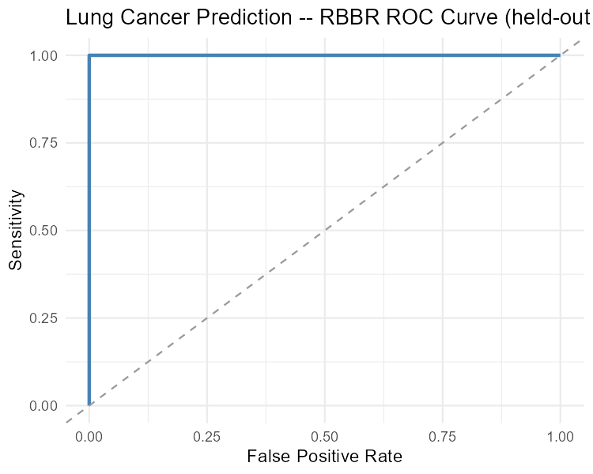

# RBBR on the Lung Cancer Prediction Dataset

A worked example applying **Regression-Based Boolean Rule (RBBR)** — an
interpretable predictive modeling framework for medical data — to a small,
real-world lung cancer screening dataset.

## Introduction

In clinical practice, accurate disease-risk prediction needs to come with
transparent, human-understandable explanations to support diagnostic
confidence and guide treatment decisions. Black-box models such as deep
neural networks can achieve high accuracy but offer little insight into
*why* a prediction was made, which limits clinical trust and adoption.

**RBBR** addresses this by automatically deriving clinically interpretable
Boolean rules (logical AND/OR combinations of up to three clinical
features) directly from patient data. Candidate rules are used as inputs to
a ridge regression model predicting the disease outcome, rule importance is
estimated via the regularized regression coefficients, and the most
parsimonious, best-fitting rule sets are selected using the Bayesian
Information Criterion (BIC). The result is a small set of rules of the form
*"if symptom/risk-factor A and B, then high risk"* that clinicians can
directly inspect and validate.

This repository demonstrates RBBR on the **Lung Cancer Prediction**
dataset — a small screening dataset with four clinical/lifestyle features —
and reproduces the rule set reported for this dataset in the RBBR paper.

## Data

- **Source:** [Lung Cancer Dataset on Kaggle](https://www.kaggle.com/datasets/yusufdede/lung-cancer-dataset?select=lung_cancer_examples.csv) (file: `lung_cancer_examples.csv`)
- **Samples:** 59 patients (31 negative / 28 positive for lung cancer)
- **Features:** `Age`, `Smokes` (cigarettes/day), `AreaQ` (air-quality /
  environmental exposure score), `Alcohol` (units consumed) — plus `Name`
  and `Surname` identifier columns, which are dropped before modeling
- **Target:** `Result` — binary, 0 = no lung cancer, 1 = lung cancer

> Raw data is **not bundled** in this repo (per `data/data_sources.md`,
> the original Kaggle license terms should be checked before
> redistribution). Download it from the Kaggle link above and save it
> as `data/raw/lung_cancer_examples.csv` before running the script.

## Where this fits in the repo

This example lives in `examples/lung_cancer_prediction_example.R`, with its
outputs in `results/lung_cancer_prediction_example/`. See the repo root
[`structure.md`](../structure.md) for the full layout.

## Code

The full pipeline — load, clean, scale, split, train, predict, evaluate,
save — is in [`lung_cancer_prediction_example.R`](./lung_cancer_prediction_example.R) (same folder).
It uses the [RBBR](https://cran.r-project.org/package=RBBR) CRAN package.

**To run:**

```bash
Rscript examples/lung_cancer_prediction_example.R
```

Requires R packages: `RBBR`, `readr`, `PRROC`, `ggplot2` (installed
automatically if missing). The script trains a single RBBR model on an
80/20 train/test split (seed = 42), searching all subsets of up to three
features and selecting rule sets by BIC.

## Results

### Best inferred Boolean rule (lowest BIC)

```
(Age ∧ AreaQ ∧ Alcohol) ∨ (Age ∧ ¬AreaQ ∧ Alcohol) ∨
(¬Age ∧ ¬AreaQ ∧ Alcohol) ∨ (Age ∧ ¬AreaQ ∧ ¬Alcohol)
```

| Rule set | R² | BIC |
|---|---|---|
| **Age ∧ AreaQ ∧ Alcohol (best)** | **0.99** | **−257.92** |
| Age ∨ Alcohol | 0.97 | −227.15 |
| Age ∧ Smokes ∧ AreaQ | 0.96 | −206.88 |
| Age ∧ Smokes ∧ Alcohol | 0.96 | −203.45 |
| Age ∧ ¬AreaQ | 0.91 | −175.83 |

This closely matches the rule set reported in the original RBBR paper for
this dataset (Age, AreaQ, and Alcohol as the dominant risk-factor
combination, with R² = 0.92 and BIC = −207 on the full dataset) —
**Smoking is notably absent from the top-ranked rule**, while `Age ∨
Alcohol` and Smokes-based combinations emerge as close runners-up,
consistent with the paper's Rule Sets 2 and 3.

### Held-out test performance (n = 11)

| Metric | Value |
|---|---|
| Accuracy | 0.909 |
| AUC | 1.000 |
| AUPRC | 1.000 |

**Confusion matrix:**

| True \ Predicted | 0 | 1 |
|---|---|---|
| **0** | 6 | 0 |
| **1** | 1 | 4 |



Only one misclassification (a false negative) out of 11 held-out patients,
with perfect ranking (AUC/AUPRC = 1.0) on this small test split.

### Takeaway

On this compact screening dataset, RBBR independently rediscovers the
Age–AreaQ–Alcohol interaction highlighted in the original paper as the
most explanatory and predictive Boolean rule for lung cancer risk, while
achieving strong held-out discrimination despite the very small sample
size (n = 59).

## Citation

If you use this example, please cite the RBBR paper:

> Eskandarian, M., & Malekpour, S. A. (2026). *Interpretable Predictive
> Modeling for Medical Data Using Boolean Rule-aware Regression.* bioRxiv.
> https://doi.org/10.64898/2026.05.14.725084

and the dataset:

> Dede, Y. *Lung Cancer Dataset.* Kaggle.
> https://www.kaggle.com/datasets/yusufdede/lung-cancer-dataset
